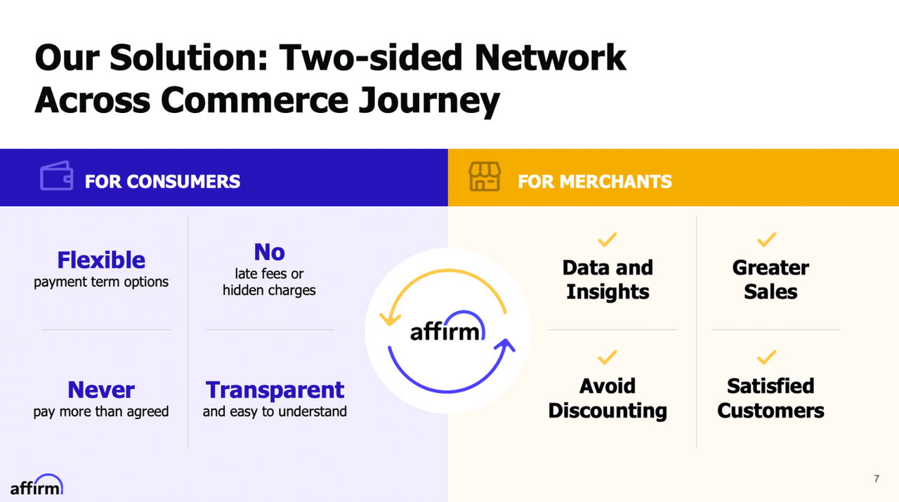

# **Affirm - US Leader in the "Buy Now Pay Later (BNPL)" Industry**

---

## **Company Overview:**

Affirm is a FinTech company founded in 2012 by Max Levchin, Nathan Gettings, Jeffrey Kaditz, and Alex Rampell.  Max was a Co-Founder of PayPal in a prior role and Nathan was a Founder of Palantir Technologies in a prior role.  The team was working on product testing in the first two years of the business with the mission to "Deliver financial products that improve lives".  

The companies goal was to make this happen by building the next generation eCommerce and mobile payments & credit platform for consumers and retailers that provided a more transparent, user friendly, technology driven financial product experience that built trust with their customers.  The core focus of their financial products was to help customers spend responsibly and confidently because they clearly understood the costs of financing purchases and saw exactly what their payment plan would BEFORE purchasing an item.  Affirm would build trust with customers by not surprising them with post-purchase late fees and unexpected additional financing costs.

Affirm went through 12 rounds of VC funding prior to going public in January of 2021.  They raised a total on $1.5B. in funding over 12 rounds from 2014-2020.  Prior to 2014, HVF Studio Labs funded the start-up (Founders money).  Khosla Ventures and Lightspeed Ventures were the first two VC's to fund Affirm in its Series A round in 2014.  Andreessen Horowitz, Spark Capital, Thrive Capital, Durable Capital Partners, Ribbit Capital and the Founders were other major funders over the course of all VC rounds, Affirm went public in 2021.

| Year | Funding Round | Money Raised | Lead Investor |
| --- | --- | --- | --- | 
| 2014 | Series A |  $45 M | Khosla & Lightspeed |
| 2015 | Series B | $275 M | Spark Capital |
| 2016 | Series D | $100 M | Founders Fund |
| 2017 | Series E | $200 M | GIC |
| 2019 | Series F | $300 M | Thrive Capital |
| 2020 | Series G | $500 M | Durable Capital |
| 2021 | IPO | $1.2 B | IPO Value: $11.9 B. |
 
---

## **Business Activities:**

### ***Value Proposition***

* The Founders were trying to solve the problem that old, legacy payment, credit and technology infrastructure that existed at all the top banks and lending institutions in the United States was driving harmful and deceptive outcomes with poor experiences for customers and merchants.  Affirm was looking to solve this problem by building a technologically advanced, mobile first eCommerce platform that supported more innovation to build a better customer and merchant experience.  The founding principles involved putting people first through simple, transparent products and services with no surprises and no hidden fees.     

* Affirm believes it delivers on its promises by offering a competitive advantage in the way it utilizes technology in credit underwriting and risk management at the Point of Sale (POS) in offline (brick and mortar) retail environments and in online eCommerce transactions.  Affirm delivers to merchants a multi-channel POS credit solution that results in lower fraud rates, higher credit approval rates, lower credit loss rates and higher retail and eCommerce sales.  This is a significant win for merchants, Affirm is telling them they can drive merchant sales higher by instantly approving shoppers for credit when they check-out (online or offline).  Customers shopping at retail stores win because they have another way to pay for a purchase that increases their purchasing power and flexibility.  

### ***Consumer and Merchant Focused Solutions***

* Affirm's core product is a "Buy Now Pay Later" credit product.  This product gives consumers the option to buy products online or offline instantly while paying for the product over 6 weeks to 60 months.  This product delivers instant loan approval on the spot through a simple, frictionless application process that provides customers with 0% APR offers or simple interest loan offers (not compounding interest loan offers which is the standard product at all other lenders - this is another competitive selling point for Affirm).  The BNPL product gets delivered via a payment option at check-out alongside credit, debit or cash options or a virtual single use digital visa card that can get used at check-out.  This BNPL product is Affirms primary revenue and growth driver, they have added additional products such as an Affirm debit card and high yield savings account to deepen customer relationships.

* Affirm also has merchants as customers because they have to convince merchants to offer their BNPL payment product at check-out along side their other payment options (credit cards, debit cards, cash, prepaid cards and checks).  Affirm leverages their own direct Application Programming Interface (API) to help merchants easily incorporate their payment option at check-out.  Merchants are always interested in anything that helps them drive sales growth and Affirm's BNPL product helps merchants do just that; Merchants also determine if they want to utilize 0% APR financing options or promotional pricing options financed by suppliers to drive sales.  These financing options funded by merchants, manufacturers and merchant suppliers flow to Affirm as revenues to support the BNPL product.   

* Merchants are also provided relationship management support, reporting and analytics insights into customer spending patterns.  Affirm utilizes their technology platform to deliver more in-depth, real-time decision analytics to help merchants drive more sales growth.  This feedback loop between consumer data and merchant data helps drive future sales by better targeting price promotions for BNPL financing which in turn drives Affirms sales growth.  

### ***Affirm's Competitive Advantages***

#### *Network Effects*

* Affirm is developing a closed loop merchant-consumer payments/credit network ecosystem that rivals Visa and MasterCard except they're not just the payment rails for processing payment but they're also the issuing creditor.  In the Visa/MC system, the bank is the credit issuer and does not fully own Visa/MC.  Affirm is the credit issuer and the payment processor all in one.  The competitive advantage of a closed loop network is you have data capture from the merchant side and credit issuing side to that helps Affirm support merchant sales insights and credit risk insights for BNPL product risk management.   

* As this closed loop network grows in scale, Affirm will see more scale economies in costs, risk management, merchant sales support and consumer loyalty

#### *Data Advantages* 

* Affirm has created a competitive advantage by leveraging unique data sources from merchants (SKU level purchase history data) and combined it with new data sources derived from their mobile/eCommerce experience to better underwrite risk decisions and thus lower credit risk and increase credit approval rates.  They also have the latest technology to collect, process and analyze big data at scale to complete real time credit decisions utilizing machine learning based models that capture more data faster and utilize this data for BNPL pricing, fraud risk, credit risk and approve/decline decisions. 

### *Superior Proprietary Risk Models*

* Traditional banks use FICO score and static internal credit scores based on payment history, credit utilization, delinquency history and credit inquiries.  These lenders don't use transaction level data, merchant data or eCommerce/Mobile data as extensively in risk management.  In addition, Affirm's new technology leverages continuous learning to constantly update risk models real time with the ability to scale these models rapidly. 

#### *Technology and Infrastructure*

* The data advantage requires a technology infrastructure advantage to make things work in real time.  Affirm has deployed the latest in machine learning, AI and Cloud based technology that helps support operational execution of their BNPL product at POS.  Legacy banks do not have all this new technology infrastructure in place to deliver such a product at scale.  In addition, the new technology comes with direct API access that helps on-board any retailer into Affirm systems at a low cost to the retailer.  This is another huge advantage over legacy banks who require a large IT project for integration that also costs the retailer IT resources (people and financial).  Affirm can integrate a new retailer within days of signing a contract due to its in-house, custom built API technology.

* The Affirm technology platform has 3 specific elements: point-of-sale payment solutions for consumers, merchant commerce solutions and a consumer focused app.  All this technology is custom built in-house instead of off the shelf purchases of technology.  Affirm believes it's own engineered technology helps them deliver a competitive edge in delivering better products, better service and betters results to consumers and merchants vis-a-vis competitors.    

---

## **Market Size:**

* Credit Suisse in its report on Affirm estimated the Total Addressable Market (TAM) for BNPL products is ~3% of the total US eCommerce market which equals ~$50 B. market size in 2023.  They further estimate the upside for this market is an additional 3% for a total of 6% of the Total US eCommerce market or ~$100 B. in size.

* BNPL product penetration is much lower in the US compared to other countries like Sweden, Germany, Australia.  The hypothesis behind this is related to interchange regulations and credit card rewards programs.  In the US, high interchange fees paid by merchants fund rich credit card rewards programs.  Given customers like these rewards programs, adoption of other payment option is much lower in the US than other countries.  Sweden, Germany and Australia have more stringent interchange fee caps that eliminate credit card reward programs and thus BNPL penetration is greater than in the US (8-25% vs. 3%).  

---

## **Competitive Landscape:**

* Affirm competes in the payments & lending vertical of the FinTech industry.  Its primary payment competitors are Visa, MasterCard and PayPal.  are US national banks with credit card and consumer installment loan operations at scale.  These competitors include: JP Morgan Chase, Citi, Bank of America, Capital One, Discover Card and AMEX.  New lending competitors such as Goldman Sachs and FinTech firms such as Klarna (Europe centric), Block and AfterPay (Australia centric) are also competitors in this space.

* Affirm, Klarna are the two leaders in the BNPL lending space.  Klarna in Europe and Affirm in the US.  As leaders in this space, they have really been the trend setters, disruption leaders and innovators in this space.  None of the competitors above come close to matching the technology, credit product, data and network effects.  Affirm is the US marketshare leader in the BNPL space with over 30% of total BNPL transactions going through Affirm (in 2021).  Credit Suisse projects their 30.8% market share to grow to 35.8% in 2023.  Klarna and AfterPay are the top 2 competitors to Affirm in the BNPL space.  

* Entrenched competitors such as JP Morgan Chase, Capital One and Citi compete with Affirm by blocking access to large retailers as they control credit programs with large retailers and control more of eCommerce payment infrastructure.

---

## **Affirm Business Results:**

* BNPL volume has grown from 0.9% of Total eCommerce in 2019 to a projected 3% of Total eCommerce volume in 2023.  Industry volume growth rates have come down from 93% in 2019 to 33% in 2023 (per Credit Suisse report).  Affirm holds the #1 position in BNPL market share in the US.  

* From their annual report, Affirm has shown the following growth in it's core business metrics from FY20 to FY 22:

* Customers have grown from 3.6 M in 2020 to 14 M in 2022 (97% CAGR)

* Gross Merchandise Volume (GMV) has grown from $4.6 B. in 2020 to $15.5 B. in 2023 (83% CAGR)

* Active Merchants have grown from 6,000 in 2020 to 235,000 in 2022 (548% CAGR)

* Total Revenues have grown from $510 M in 2020 to $1.35 B. in 2022 (63% CAGR)

* In summary these growth rates FAR EXCEED anything achieved at traditional banks and credit card companies.

* A key customer metric for loyalty is the Net Promoter Score (NPS), these scores are usually low with all traditional financial services companies (in the single digits usually) so when Affirm came out with a +83 NPS score, that confirmed it's technology driven customer experience sets it apart from the competition.

* Another key industry metric that is working for Affirm is its Average Order Value (AOV), Affirm has an AOV of $657 vs. AfterPay at $150.  The driver for this difference is Affirm has the ability to underwrite and approve higher ticket purchases vs. competing BNPL competitors.  Affirm for example is the primary BNPL for Peleton and helps Peleton sell their higher ticket bikes via BNPL.  Affirm offers payment terms from 6 weeks to 60 months which allows for higher ticket sales vs. competitors like AfterPay usually offer terms up to 30 days. 

* A final metric differentiator that confirms the value of their data and risk management strategy is their % of loans 30+ days delinquent vs. competitors.  Affirm delinquency rates are approx. ~50-60% lower than competing FinTech lenders and ~60-70% lower than competing personal lenders (banks) as of their last tranche reported Sept. 2020 by Credit Suisse.  

---

## **Recommendations**

* Overall the Affirm is a highly successful FinTech company in the payments and lending space.  They are one of the few unicorns that actually made it through the COVID crisis and grew their business consistently through 2022.  Other BNPL firms like LendUp did not make it, they were shut down by the CFPB for regulatory violations.

* The big challenge for Affirm now is the rise in inflation over the last 12 months and the rise in interest rates have impacted consumer spending.  The personal financial situations of most consumers has deteriorated to where delinquencies are rising and spending is falling.  These macroeconomic changes will significantly impact Affirm and the BNPL industry.  In addition, regulators are stepping up their calls for more Federal oversight to the lending practices of BNPL firms which could impact Affirm's business model.

* My recommendations are based on the current macroeconomic environment and how does Affirm continue its robust growth trajectory through economic turbulence?  What risk mitigation steps will the company need to take to protect against a downward credit cycle while continuing to steal eCommerce market share away from credit card companies?

* I think a couple of key issues need to be addressed: 

* Build a more robust portfolio of assets that can drive growth during challenging retail times.  Assuming economic growth slows (which is forecasted for the next 3 years) and reduces retail sales growth.  Consumer staples are necessities whose sales don't decline during a downturn.  How do you drive more BNPL usage in staples? 

* Drive more purchase volume through lower ticket necessities vs. only higher ticket luxury goods. 

* Drive merchant adoption at lower end retail outlets vs. higher end retail outlets

* Diversify product revenues towards additional retail spending segments such as small business spending, consumer durable goods spending, consumer auto spending.  This may be adversely effected during a downturn, however with 0% marketshare in these segments, all revenues should be incremental gains.  The BNPL product will need to be modified for consumer durable goods (appliances, TV's etc.) and auto purchases.

* Push more revenue growth in alternative products adjacent to the BNPL product.  Examples include: Loan reload programs for previous customers, expand debit card business, new investment product business as the firm expands into more diversified financial products.

* Shift the business model to more of a payments platform similar to Visa/MC where new banks enter the system to buy the loans or originate new loans on the platform from retailers vs. Affirm being the final creditor in the business.

---

### *Research Materials*

* [Credit Suisse Research Report - Affirm](https://research-doc.credit-suisse.com/docView?language=ENG&format=PDF&sourceid=em&document_id=1083422181&serialid=ywSgRJnHeNrgd8%2B2fh1C8PmSF0Wg%2Bjw1Zl3ATrbRBxs%3D&cspId=null)

* [Affirm Website](https://www.affirm.com/)

* [Affirm 2022 Annual Report](https://investors.affirm.com/financial-information/annual-reports)

* [Crunchbase - Affirm](https://www.crunchbase.com/organization/affirm)

* [WSJ Affirm Article](https://www.wsj.com/articles/BL-DGB-35678)

* [LendUp Competitor Info](https://www.consumerfinance.gov/about-us/newsroom/cfpb-shutters-lending-by-vc-backed-fintech-for-violating-agency-order/)

* [Techcrunch - Affirm](https://techcrunch.com/2023/02/08/affirms-stock-plunges-as-it-misses-earnings-cuts-500-jobs-and-shutters-crypto-unit/)

